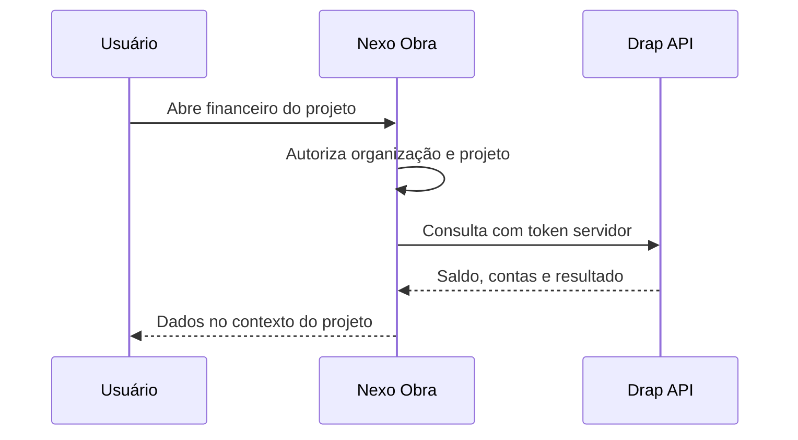
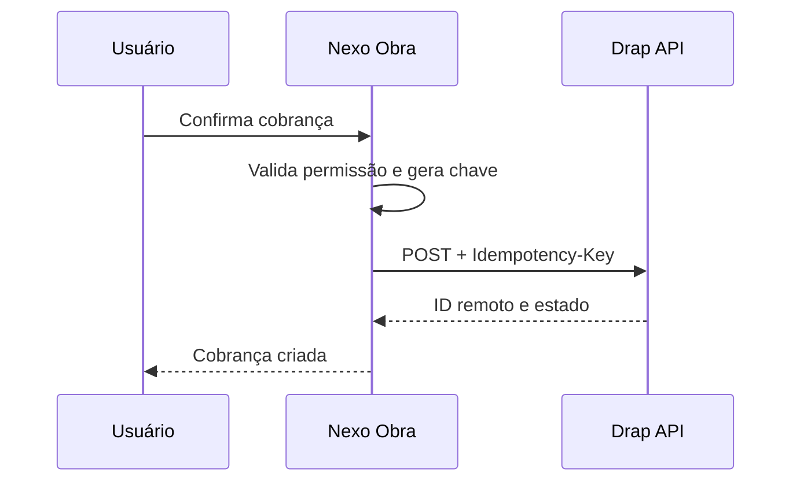
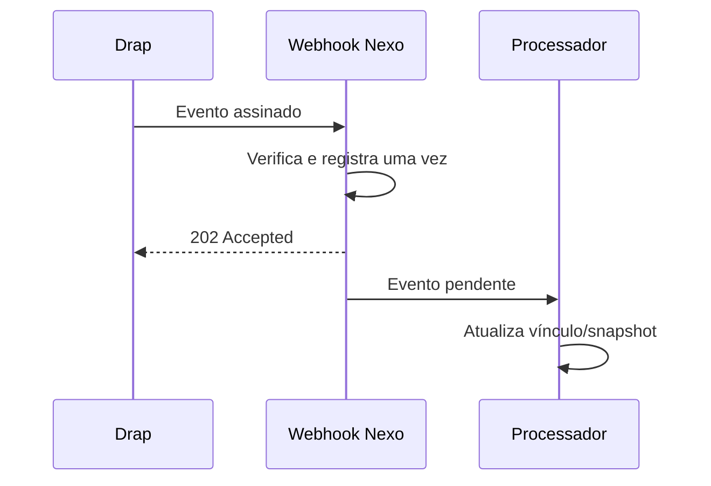

# Contrato recomendado para integração remota com a Drap

Este documento separa a experiência da Nexo Obra do sistema financeiro. Ele é uma proposta técnica a ser alinhada com a API oficial da Drap; não afirma que os caminhos abaixo já existem.

## Objetivo

O usuário trabalha na Nexo Obra. Quando precisa de informação financeira, o backend consulta a Drap. Quando uma ação operacional deve produzir efeito financeiro, o backend cria a operação na Drap e guarda apenas o vínculo, o estado de sincronização e um snapshot para leitura resiliente.

## Fluxos

### Leitura



### Escrita idempotente



### Atualização assíncrona



## Endpoints que a Nexo Obra precisa

Os nomes são semânticos. Substitua pelos caminhos oficiais no adaptador.

| Capacidade | Método sugerido | Uso |
| --- | --- | --- |
| Resumo da empresa | `GET /finance/summary` | saldo, a pagar, a receber e projeção |
| Transações | `GET /transactions` | drill-down e conciliação visual |
| Contas a receber | `GET /receivables` | parcelas e atraso por cliente/projeto |
| Contas a pagar | `GET /payables` | compromissos e previsão de caixa |
| Centro de custo | `POST /cost-centers` | representar projeto ou obra |
| Cobrança | `POST /charges` | PIX, boleto ou cartão após confirmação |
| Lançamento | `POST /transactions` | despesa/receita originada na operação |
| DRE | `GET /reports/income-statement` | resultado consolidado e por centro de custo |

## Cabeçalhos recomendados

```http
Authorization: Bearer <token-servidor>
Accept: application/json
Content-Type: application/json
Idempotency-Key: <uuid-da-operacao-local>
X-Correlation-Id: <uuid-da-requisicao>
```

O nome do header de autenticação pode ser configurado por `DRAP_API_KEY_HEADER` quando a API não usa Bearer.

## Mapeamentos persistidos

| Entidade Nexo | ID Drap | Observação |
| --- | --- | --- |
| Organização | empresa/tenant | obrigatório para todas as chamadas |
| Cliente | pessoa/contato | evita duplicar cobrança por nome |
| Projeto/obra | centro de custo | base para resultado por trabalho |
| Orçamento aprovado | documento/origem | rastreabilidade da cobrança |
| Cobrança | charge/receivable | guardar ID e estado, não recalcular saldo |

## Webhooks

O endpoint local é `POST /api/integrations/drap/webhook`.

Contrato esperado atualmente:

- assinatura hexadecimal HMAC SHA-256 em `x-drap-signature` ou `x-webhook-signature`;
- ID em `id` ou `event_id`;
- tipo em `type` ou `event_type`;
- empresa em `company_id`, `companyId` ou dentro de `data`;
- o ID do evento é chave primária para impedir duplicação.

Quando a documentação oficial divergir, altere apenas o tradutor da borda. Não leve campos remotos para o domínio central.

Eventos úteis:

- `transaction.created|updated|deleted`;
- `receivable.created|paid|overdue|cancelled`;
- `payable.created|paid|overdue|cancelled`;
- `charge.created|paid|failed|refunded`;
- `invoice.authorized|rejected|cancelled`;
- `reconciliation.updated`.

## Resiliência

- Timeout curto para telas: 8 segundos no protótipo.
- Retry automático apenas para GET e escritas com idempotência.
- Circuit breaker após falhas consecutivas.
- Snapshot com horário para leitura quando a Drap estiver indisponível.
- Reconciliação periódica para cobrir webhook perdido.
- Fila de erro com reprocessamento manual e motivo legível.
- Nunca mostrar dado de demonstração como se fosse financeiro real.

## Segurança

- Token e segredo somente no ambiente de execução do servidor.
- Token por ambiente e, se possível, escopo mínimo por empresa.
- Rotação sem indisponibilidade.
- Payload de webhook limitado por tamanho antes de persistir.
- Logs sem token, documento, dados bancários ou payload completo sensível.
- Auditoria de quem iniciou cada escrita remota.

## Checklist de homologação

- [ ] OpenAPI oficial recebida e versionada.
- [ ] Sandbox e empresa de teste criadas.
- [ ] Autenticação e rotação validadas.
- [ ] Paginação, moeda, fuso e arredondamento confirmados.
- [ ] Testes de contrato com respostas reais anonimizadas.
- [ ] Assinatura do webhook confirmada byte a byte.
- [ ] Evento repetido não duplica efeito.
- [ ] Timeout e indisponibilidade exibem estado correto.
- [ ] Reconciliação encontra e corrige divergência.
- [ ] Escritas financeiras auditadas de ponta a ponta.
