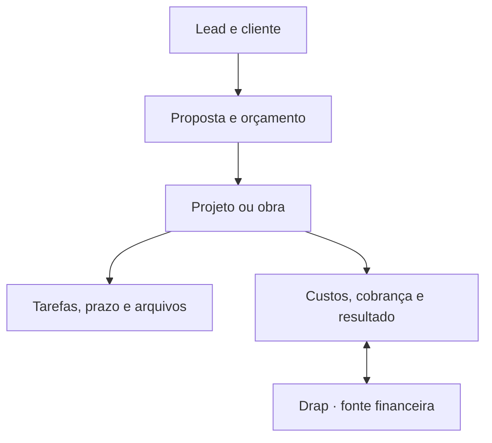

# Nexo Obra

> Nome provisório. Um SaaS objetivo para escritórios de arquitetura, engenharia, reformas e construção civil.

Este repositório é uma fundação executável para construir a plataforma no Claude Code. Ele já contém uma interface responsiva e navegável, dados demonstrativos realistas, modelo de dados multiempresa, uma API inicial de projetos e o limite técnico da integração financeira remota com a Drap.

O objetivo não é copiar a Vobi. O objetivo é reunir o ciclo do negócio em um fluxo menor, mais claro e mais previsível:



## O que já está no código

- Painel “Visão geral” com prioridades, trabalhos ativos, funil e resumo financeiro.
- Áreas navegáveis de projetos, obras, orçamentos, cronograma, CRM, financeiro, equipe, tarefas e arquivos.
- Interface responsiva, com menu recolhível e busca.
- Fluxo de criação rápida preparado para virar formulários reais.
- Dados de demonstração isolados em `lib/demo-data.ts`.
- Esquema relacional multiempresa em `db/schema.ts`.
- Endpoint inicial `GET/POST /api/projects` com validação Zod e separação por organização.
- Adaptador financeiro exclusivamente no servidor em `lib/integrations/drap.ts`.
- Endpoint de resumo financeiro com fallback explícito para demonstração.
- Webhook Drap com verificação HMAC SHA-256, identificação da empresa e idempotência pelo ID do evento.
- Instruções permanentes para o Claude Code em `CLAUDE.md`.

## Princípios do produto

1. **A primeira tela é uma fila de decisões.** Mostrar o que venceu, bloqueia prazo, afeta caixa ou depende do usuário.
2. **Uma informação tem um único dono.** A Drap é a fonte financeira; esta aplicação é a fonte de projetos, obras, tarefas e documentos.
3. **Contexto antes de módulo.** O usuário entra em um projeto e encontra escopo, cronograma, orçamento, documentos, horas e financeiro relacionados.
4. **Exceção antes de relatório.** O sistema destaca desvios e deixa o detalhamento a um clique.
5. **Cadastro progressivo.** Pedir apenas o necessário em cada etapa; campos avançados aparecem quando passam a ser úteis.
6. **Nenhuma tela sem ação clara.** Cada página deve responder “o que devo fazer agora?”.
7. **Sem conteúdo ornamental.** Nada de cards redundantes, textos de apresentação dentro do produto ou menus criados apenas para parecer completo.

## Módulos e escopo

| Módulo | Fluxo principal | Primeira entrega real |
| --- | --- | --- |
| Visão geral | Entender o dia e agir | Prioridades, desvios, próximos marcos e caixa |
| CRM e clientes | Lead até fechamento | Funil, histórico, próximo contato e conversão em projeto |
| Orçamentos | Custo até aceite | Composições, BDI, margem, versões, proposta e aprovação |
| Projetos | Briefing até entrega | Etapas, entregáveis, horas, responsáveis e resultado |
| Obras | Planejamento até encerramento | Diário, fotos, compras, medições, ocorrências e avanço |
| Cronograma | Planejar e recalcular | Gantt, dependências, responsáveis e previsto x realizado |
| Tarefas | Executar sem perder contexto | Prioridade, checklist, dependência, prazo e apontamento |
| Equipe | Distribuir capacidade | Papéis, permissões, carga e horas planejadas x realizadas |
| Arquivos | Encontrar a versão certa | Pastas por projeto, revisão, metadados e acesso do cliente |
| Financeiro | Ver resultado no contexto | Saldo, contas, caixa e resultado por projeto vindos da Drap |

## Stack escolhida

- TypeScript, React 19 e Next.js 16 compatível com Vinext.
- Tailwind CSS 4 e componentes acessíveis do catálogo Shadcn já incluído.
- Drizzle ORM com SQLite/D1 para os dados operacionais.
- R2 para arquivos binários e D1 para seus metadados.
- API REST interna com validação Zod.
- `fetch` no servidor para a integração remota com a Drap.
- Web Crypto para validação de webhooks.

A arquitetura pode ser adaptada pelo Claude Code para Postgres, Supabase, Neon ou outro provedor. O domínio e os limites entre módulos devem permanecer os mesmos.

## Como abrir no Claude Code

Pré-requisitos: Node.js 22.13 ou superior e npm.

```bash
cd nexo-obra
npm ci
cp .env.example .env
npm run dev
```

Depois, abra a pasta no Claude Code e use este primeiro comando:

```text
Leia CLAUDE.md e README.md por completo. Preserve a arquitetura multiempresa e o limite da integração Drap. Primeiro execute o build e corrija apenas erros reais. Depois implemente a Fase 1 do roadmap, começando pelo fluxo autenticado organização → cliente → projeto → tarefa. Faça mudanças pequenas, valide ao final de cada fatia e atualize o README quando o estado do produto mudar.
```

Comandos úteis:

```bash
npm run dev
npm run build
npm run lint
npm run db:generate
```

## Repositório e publicação

- O código-fonte oficial fica em [empresaexemplo9-gif/Nexo-obra](https://github.com/empresaexemplo9-gif/Nexo-obra).
- O projeto `nexo-obra` no Vercel está vinculado a esse repositório; alterações integradas à branch `main` seguem para a publicação de produção e branches de trabalho geram validações de preview.
- O projeto também preserva o vínculo com o OpenAI Sites por meio do `project_id` em `.openai/hosting.json`.
- Tokens, chaves e segredos de produção devem ser configurados nos ambientes de publicação. Eles não pertencem ao Git nem ao arquivo de hosting.

## Configuração da Drap

Crie `.env` a partir de `.env.example`:

```dotenv
DRAP_API_URL=https://empresa.drap.app.br
DRAP_API_TOKEN=token_de_servico
DRAP_API_KEY_HEADER=
DRAP_SUMMARY_PATH=/api/v1/finance/summary
DRAP_WEBHOOK_SECRET=segredo_compartilhado
```

### Importante

O site público da Drap informa suporte a API REST e webhooks assinados, mas não expõe a documentação técnica nem confirma os caminhos de endpoint. Por isso:

- `/api/v1/finance/summary` é um contrato configurável de referência, não um endpoint confirmado;
- o token nunca é enviado ao navegador;
- o adaptador aceita nomes de campos comuns em português e inglês, mas deve ser ajustado ao JSON oficial;
- até as credenciais e o contrato real serem fornecidos, a tela mostra dados marcados como demonstração;
- nenhuma escrita financeira deve ser liberada antes de testes em ambiente sandbox.

Para concluir a conexão real, obtenha da Drap:

1. URL base de API e ambiente sandbox.
2. Método de autenticação e rotação do token de serviço.
3. OpenAPI ou lista oficial de endpoints.
4. Identificador estável da empresa/tenant.
5. Eventos disponíveis e formato da assinatura dos webhooks.
6. Política de rate limit, paginação, erros e idempotência.
7. Campos necessários para centro de custo por projeto/obra.

Veja o contrato recomendado em `docs/DRAP-INTEGRATION.md`.

## Divisão de responsabilidade dos dados

| Dado | Fonte oficial | Uso na Nexo Obra |
| --- | --- | --- |
| Clientes | Nexo Obra, com ID remoto opcional | CRM, projeto, obra e proposta |
| Projetos e obras | Nexo Obra | Contexto central de operação |
| Tarefas, horas e cronograma | Nexo Obra | Planejamento e execução |
| Orçamentos técnicos e versões | Nexo Obra | Composição, BDI, margem e aceite |
| Arquivos e revisões | Nexo Obra | R2 + metadados no banco |
| Lançamentos, contas e saldo | Drap | Consulta remota e vínculo por centro de custo |
| Cobranças, PIX, boleto e nota | Drap | Acionamento remoto após confirmação |
| DRE e conciliação | Drap | Leitura e contextualização por projeto |

## Modelo multiempresa

Toda tabela operacional carrega `organization_id`. Nunca aceite o identificador de organização informado apenas pelo cliente. A API deve derivá-lo da sessão autenticada e verificar a associação do usuário no servidor.

O endpoint inicial de projetos usa temporariamente o header `x-organization-id` para deixar o contrato visível. Ele precisa ser substituído pela organização resolvida pela autenticação antes de produção.

Papéis mínimos recomendados:

- `owner`: cobrança, integrações, segurança e acesso total;
- `admin`: equipe, configurações e operação total, sem propriedade da assinatura;
- `manager`: projetos, obras, orçamentos e relatórios;
- `member`: itens atribuídos e módulos liberados;
- `partner`: acesso limitado a projetos específicos;
- `client`: portal externo somente para leitura/aprovação/comentário.

## Estrutura do projeto

```text
app/
  api/
    integrations/drap/  # proxy financeiro e webhook
    projects/           # primeira API operacional
  layout.tsx
  page.tsx
components/
  nexo-app.tsx          # protótipo funcional dos módulos
  ui/                   # primitivas acessíveis
db/
  index.ts              # acesso centralizado ao banco
  schema.ts             # modelo relacional multiempresa
docs/
  DRAP-INTEGRATION.md
lib/
  demo-data.ts
  integrations/drap.ts
build/
  sites-vite-plugin.ts
drizzle/
hooks/
public/
scripts/
tests/
vendor/
worker/
  index.ts
.openai/
  hosting.json
CLAUDE.md
```

## Roadmap de implementação

### Fase 1 — núcleo operacional

- Autenticação e seleção segura da organização.
- CRUD de clientes, projetos e tarefas.
- Permissões no servidor.
- Substituição dos dados demonstrativos por queries reais.
- Log de auditoria para criação, edição, exclusão e mudança de status.
- Testes de isolamento entre duas organizações.

### Fase 2 — comercial e orçamento

- Funil configurável e histórico de atividades.
- Conversão de oportunidade em cliente e projeto sem recadastro.
- Biblioteca de serviços, insumos e composições.
- BDI separado por produto/serviço, margem mínima e versões imutáveis.
- PDF de proposta e aprovação digital.
- Importação SINAPI condicionada à licença/fonte oficial escolhida.

### Fase 3 — planejamento e obra

- Etapas, dependências e recálculo do cronograma.
- Diário de obra com fotos, clima, equipe, ocorrências e assinatura.
- Medições, compras, fornecedores e previsto x realizado.
- Cronograma físico-financeiro e curva S.
- Portal enxuto do cliente.

### Fase 4 — financeiro remoto e automações

- Conector Drap homologado em sandbox.
- Vínculo de projeto com centro de custo remoto.
- Leitura de saldos, contas e DRE por projeto.
- Criação remota de cobrança/conta somente com idempotência.
- Processador assíncrono de webhook, reconciliação e tela de falhas.
- Alertas úteis: atraso, caixa negativo, margem baixa e tarefa bloqueadora.

## Critérios mínimos antes de produção

- Autenticação, autorização e isolamento multiempresa testados.
- Tokens e segredos somente no servidor e no gerenciador de segredos.
- Rate limiting em autenticação, uploads, criação e webhooks.
- Trilha de auditoria sem dados sensíveis desnecessários.
- Backup, restauração e exportação da conta validados.
- Webhooks com assinatura, idempotência, reprocessamento e dead-letter queue.
- Uploads com limite de tamanho, MIME permitido e varredura de segurança.
- LGPD: base legal, retenção, exclusão, portabilidade e registro de consentimento.
- Monitoramento de erro, latência, sincronização e saúde da integração.
- Teste de acessibilidade e uso real em celular no canteiro.

## Referências funcionais

O recorte funcional foi elaborado a partir das páginas públicas informadas no briefing:

- [Gestão de projetos](https://www.vobi.com.br/funcionalidades/gestao-de-projetos)
- [Gestão de obras](https://www.vobi.com.br/funcionalidades/gestao-de-obras)
- [Orçamento de obra](https://www.vobi.com.br/funcionalidades/orcamento-de-obra)
- [Gestão financeira](https://www.vobi.com.br/funcionalidades/gestao-financeira)
- [Gestão de vendas](https://www.vobi.com.br/funcionalidades/gestao-de-vendas)
- [Gestão de equipes](https://www.vobi.com.br/funcionalidades/gestao-de-equipes)
- [Gestão de arquivos](https://www.vobi.com.br/funcionalidades/gestao-de-arquivos-arq)
- [Gestão de tarefas](https://www.vobi.com.br/funcionalidades/gestao-de-tarefas)
- [Planejamento de obras](https://www.vobi.com.br/funcionalidades/planejamento-de-obras)
- [Drap Empresa](https://empresa.drap.app.br/)

Essas páginas servem apenas como pesquisa de necessidades. O código, a arquitetura, os textos e a interface deste repositório são originais.
