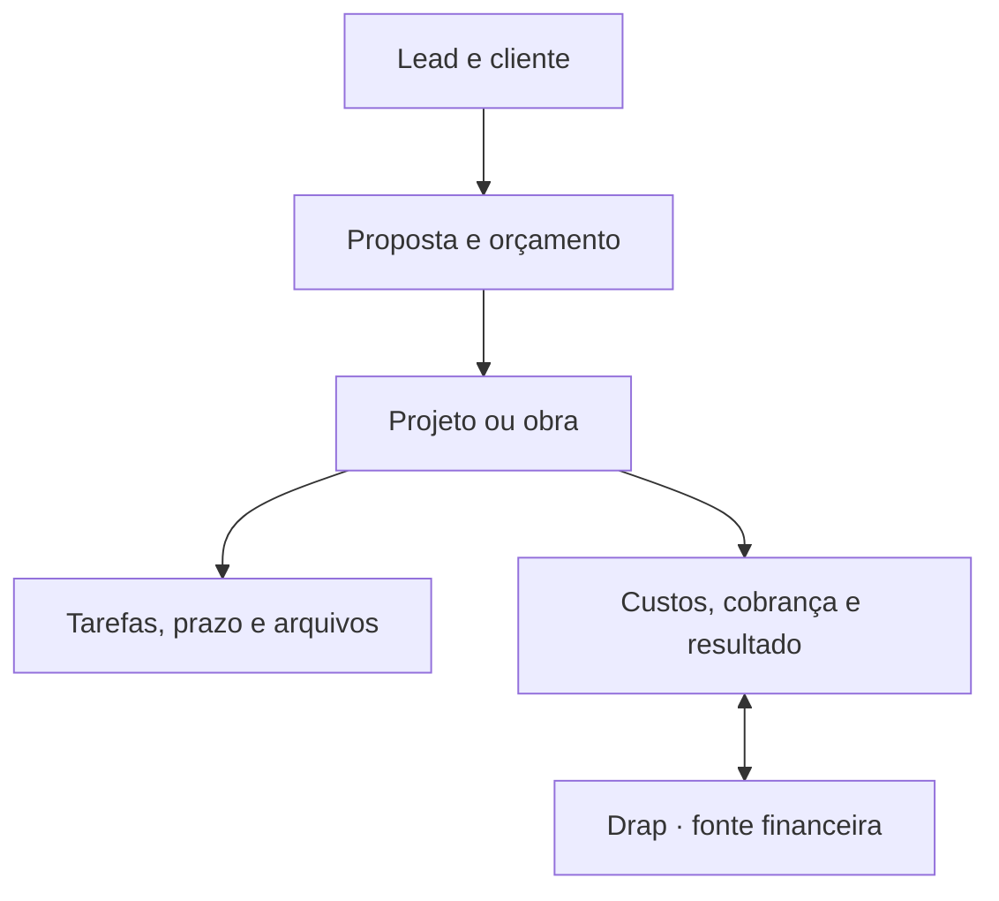

# Nexo Obra

> Nome provisório. Um SaaS objetivo para escritórios de arquitetura, engenharia, reformas e construção civil.

Este repositório contém o núcleo operacional do produto em funcionamento: fluxo autenticado multiempresa, persistência real de clientes, projetos, obras e tarefas, permissões no servidor, trilha de auditoria e o limite técnico da integração financeira remota com a Drap. Os módulos comerciais e de obra seguem em demonstração, rotulados como tal na própria tela.

O objetivo não é copiar a Vobi. O objetivo é reunir o ciclo do negócio em um fluxo menor, mais claro e mais previsível:



## O que já está no código

A Fase 1 do roadmap está implementada: o produto tem autenticação, organização
resolvida no servidor e persistência real para cliente, projeto/obra e tarefa.

**Funcionando com dados reais**

- Fluxo autenticado completo: entrar → criar empresa → cliente → projeto/obra → tarefa.
- Organização resolvida na sessão do servidor e conferida contra as associações do
  usuário a cada requisição. O navegador não escolhe a empresa.
- Papéis por capacidade (`owner`, `admin`, `manager`, `member`, `partner`, `client`),
  checados no servidor antes de qualquer escrita.
- CRUD de clientes, projetos/obras e tarefas: `GET/POST` nas coleções e
  `GET/PATCH/DELETE` por id, com validação Zod na borda.
- Seletor de empresa para quem participa de mais de uma.
- Trilha de auditoria com autor e diferença em criação, edição, exclusão e mudança
  de situação.
- Visão geral monta a fila de decisões dos dados reais: tarefa atrasada, bloqueada,
  vencendo hoje e trabalho sem responsável.
- Equipe mostra capacidade contra apontamentos reais.
- 47 testes, incluindo isolamento entre duas empresas exercitando o SQL de verdade.

**Ainda em demonstração, e rotulado como tal na tela**

- Orçamentos, cronograma, arquivos e o funil comercial seguem sobre
  `lib/demo-data.ts`, cada tela com aviso visível. As fases 2 e 3 os migram.
- O financeiro mostra dados de demonstração enquanto as credenciais e o contrato
  real da Drap não forem fornecidos.

**Limites técnicos já estabelecidos**

- Esquema relacional multiempresa em `db/schema.ts`: `organization_id` em toda
  tabela operacional.
- Adaptador financeiro exclusivamente no servidor em `lib/integrations/drap.ts`.
- Webhook Drap com verificação HMAC SHA-256, identificação da empresa e
  idempotência pelo ID do evento.
- Interface responsiva, com menu recolhível e busca.
- Instruções permanentes para o Claude Code em `CLAUDE.md`.

## Princípios do produto

1. **A primeira tela é uma fila de decisões.** Mostrar o que venceu, bloqueia prazo, afeta caixa ou depende do usuário.
2. **Uma informação tem um único dono.** A Drap é a fonte financeira; esta aplicação é a fonte de projetos, obras, tarefas e documentos.
3. **Contexto antes de módulo.** O usuário entra em um projeto e encontra escopo, cronograma, orçamento, documentos, horas e financeiro relacionados.
4. **Exceção antes de relatório.** O sistema destaca desvios e deixa o detalhamento a um clique.
5. **Cadastro progressivo.** Pedir apenas o necessário em cada etapa; campos avançados aparecem quando passam a ser úteis.
6. **Nenhuma tela sem ação clara.** Cada página deve responder “o que devo fazer agora?”.
7. **Sem conteúdo ornamental.** Nada de cards redundantes, textos de apresentação dentro do produto ou menus criados apenas para parecer completo.

## Módulos e escopo

| Módulo | Fluxo principal | Primeira entrega real |
| --- | --- | --- |
| Visão geral | Entender o dia e agir | Prioridades, desvios, próximos marcos e caixa |
| CRM e clientes | Lead até fechamento | Funil, histórico, próximo contato e conversão em projeto |
| Orçamentos | Custo até aceite | Composições, BDI, margem, versões, proposta e aprovação |
| Projetos | Briefing até entrega | Etapas, entregáveis, horas, responsáveis e resultado |
| Obras | Planejamento até encerramento | Diário, fotos, compras, medições, ocorrências e avanço |
| Cronograma | Planejar e recalcular | Gantt, dependências, responsáveis e previsto x realizado |
| Tarefas | Executar sem perder contexto | Prioridade, checklist, dependência, prazo e apontamento |
| Equipe | Distribuir capacidade | Papéis, permissões, carga e horas planejadas x realizadas |
| Arquivos | Encontrar a versão certa | Pastas por projeto, revisão, metadados e acesso do cliente |
| Financeiro | Ver resultado no contexto | Saldo, contas, caixa e resultado por projeto vindos da Drap |

## Stack escolhida

- TypeScript, React 19 e Next.js 16 compatível com Vinext.
- Tailwind CSS 4 e componentes acessíveis do catálogo Shadcn já incluído.
- Drizzle ORM com SQLite/D1 para os dados operacionais.
- R2 para arquivos binários e D1 para seus metadados.
- API REST interna com validação Zod.
- `fetch` no servidor para a integração remota com a Drap.
- Web Crypto para validação de webhooks.

A arquitetura pode ser adaptada pelo Claude Code para Postgres, Supabase, Neon ou outro provedor. O domínio e os limites entre módulos devem permanecer os mesmos.

## Como abrir no Claude Code

Pré-requisitos: Node.js 22.13 ou superior e npm.

```bash
npm ci
cp .env.example .env
npm run dev          # cria o banco D1 local na primeira execução
npm run db:migrate:local
```

O banco local do Miniflare nasce vazio, então a primeira tela cai no estado
“banco indisponível” até as migrações serem aplicadas. Rode `npm run dev` uma
vez, aplique as migrações e recarregue.

Para entrar sem o host autenticado, defina no `.env`:

```dotenv
NEXO_DEV_USER_EMAIL=voce@exemplo.test
NEXO_DEV_USER_NAME=Seu Nome
```

Na primeira entrada a tela pede o nome da empresa e torna você `owner` dela.

Comandos úteis:

```bash
npm run dev               # servidor de desenvolvimento
npm run build             # build verificado (é o que o CI roda)
npm run lint
npm test                  # build + testes
npm run db:generate       # gera migração a partir de db/schema.ts
npm run db:migrate:local  # aplica as migrações no D1 local
```

## Configuração da Drap

Crie `.env` a partir de `.env.example`:

```dotenv
DRAP_API_URL=https://empresa.drap.app.br
DRAP_API_TOKEN=token_de_servico
# Vazio usa "Authorization: Bearer <token>"; informe um header para o token cru.
DRAP_API_KEY_HEADER=
DRAP_SUMMARY_PATH=/api/v1/finance/summary
DRAP_WEBHOOK_SECRET=segredo_compartilhado
```

Nenhuma dessas variáveis pode ganhar o prefixo `NEXT_PUBLIC_`. O módulo
`lib/integrations/drap.ts` lê as credenciais do ambiente do Worker e é importado
apenas no servidor; o navegador fala com `/api/integrations/drap/summary`, nunca
com a Drap.

### Importante

O site público da Drap informa suporte a API REST e webhooks assinados, mas não expõe a documentação técnica nem confirma os caminhos de endpoint. Por isso:

- `/api/v1/finance/summary` é um contrato configurável de referência, não um endpoint confirmado;
- o token nunca é enviado ao navegador;
- o adaptador aceita nomes de campos comuns em português e inglês, mas deve ser ajustado ao JSON oficial;
- até as credenciais e o contrato real serem fornecidos, a tela mostra dados marcados como demonstração;
- nenhuma escrita financeira deve ser liberada antes de testes em ambiente sandbox.

Para concluir a conexão real, obtenha da Drap:

1. URL base de API e ambiente sandbox.
2. Método de autenticação e rotação do token de serviço.
3. OpenAPI ou lista oficial de endpoints.
4. Identificador estável da empresa/tenant.
5. Eventos disponíveis e formato da assinatura dos webhooks.
6. Política de rate limit, paginação, erros e idempotência.
7. Campos necessários para centro de custo por projeto/obra.

Veja o contrato recomendado em `docs/DRAP-INTEGRATION.md`.

## API interna

Todas as rotas resolvem a empresa pela sessão. Nenhuma aceita `organizationId` no
corpo ou em header — o schema Zod recusa o campo com 422.

| Rota | Métodos | Capacidade exigida |
| --- | --- | --- |
| `/api/session` | `GET` | — (devolve o estado da sessão) |
| `/api/organizations` | `GET`, `POST` | autenticado; quem cria vira `owner` |
| `/api/organizations/active` | `POST` | participar da empresa informada |
| `/api/clients` | `GET`, `POST` | `client:read` / `client:write` |
| `/api/clients/:id` | `GET`, `PATCH`, `DELETE` | `client:read` / `client:write` |
| `/api/projects` | `GET`, `POST` | `project:read` / `project:write` |
| `/api/projects/:id` | `GET`, `PATCH`, `DELETE` | `project:read` / `project:write` |
| `/api/tasks` | `GET`, `POST` | `task:read` / `task:write` |
| `/api/tasks/:id` | `GET`, `PATCH`, `DELETE` | `task:read` / `task:write` |
| `/api/integrations/drap/summary` | `GET` | — (marca a origem em `source`) |
| `/api/integrations/drap/webhook` | `POST` | assinatura HMAC SHA-256 |

Respostas de erro têm formato único, para a interface reagir sem depender do texto:

```json
{ "error": { "code": "forbidden", "message": "...", "fields": [] } }
```

`code` assume `unauthorized`, `no_organization`, `forbidden`, `not_found`,
`conflict`, `invalid_body`, `invalid_input`, `unavailable` ou `internal`. Em
`invalid_input`, `fields` traz `{ field, message }` por campo recusado.

Capacidades por papel:

| Capacidade | owner | admin | manager | member | partner | client |
| --- | --- | --- | --- | --- | --- | --- |
| `organization:manage` | ✅ | | | | | |
| `member:manage` | ✅ | ✅ | | | | |
| `client:read` | ✅ | ✅ | ✅ | ✅ | | |
| `client:write` | ✅ | ✅ | ✅ | | | |
| `project:read` | ✅ | ✅ | ✅ | ✅ | ✅ | ✅ |
| `project:write` | ✅ | ✅ | ✅ | | | |
| `task:read` | ✅ | ✅ | ✅ | ✅ | ✅ | |
| `task:write` | ✅ | ✅ | ✅ | ✅ | | |
| `finance:read` | ✅ | ✅ | ✅ | | | |
| `audit:read` | ✅ | ✅ | | | | |

## Divisão de responsabilidade dos dados

| Dado | Fonte oficial | Uso na Nexo Obra |
| --- | --- | --- |
| Clientes | Nexo Obra, com ID remoto opcional | CRM, projeto, obra e proposta |
| Projetos e obras | Nexo Obra | Contexto central de operação |
| Tarefas, horas e cronograma | Nexo Obra | Planejamento e execução |
| Orçamentos técnicos e versões | Nexo Obra | Composição, BDI, margem e aceite |
| Arquivos e revisões | Nexo Obra | R2 + metadados no banco |
| Lançamentos, contas e saldo | Drap | Consulta remota e vínculo por centro de custo |
| Cobranças, PIX, boleto e nota | Drap | Acionamento remoto após confirmação |
| DRE e conciliação | Drap | Leitura e contextualização por projeto |

## Modelo multiempresa

Toda tabela operacional carrega `organization_id`. O identificador de organização
nunca vem do navegador: a API o deriva da sessão autenticada e confere a
associação do usuário no servidor.

Como funciona hoje:

1. `lib/auth/identity.ts` resolve QUEM é o usuário. É a única peça que conhece o
   provedor de autenticação — hoje os headers da borda autenticada do host, com
   uma identidade de desenvolvimento habilitada por variável de ambiente fora de
   produção. Trocar de provedor é editar este arquivo.
2. `lib/auth/session.ts` resolve QUAL empresa está ativa, carregando as
   associações reais do usuário em `members`.
3. O cookie `nexo_org` guarda apenas a *preferência* de qual empresa abrir. Ele é
   reconferido contra as associações a cada requisição, então não concede nada —
   um cookie apontando para empresa alheia é simplesmente ignorado. É por isso que
   ele não precisa ser assinado.
4. `lib/data/*` exige `organizationId` em toda função e o aplica em toda cláusula
   `where`, inclusive nos joins, updates e deletes.
5. Chave estrangeira de outra empresa é recusada com 422. A FK do banco só exige
   que a linha exista; o recorte por empresa é da aplicação.
6. Registro de outra empresa responde **404, nunca 403** — 403 confirmaria que ele
   existe em algum lugar.

> **Atenção ao implantar.** O provedor de identidade atual confia em headers
> injetados pela borda autenticada. O ambiente precisa remover esses headers
> quando vierem do cliente; caso contrário qualquer visitante pode se passar por
> outro usuário. Se o destino de implantação não fizer isso, troque
> `lib/auth/identity.ts` por um provedor de sessão próprio antes de ir ao ar.

O header `x-organization-id` que a API inicial usava foi removido. Não o
reintroduza: era o furo que a Fase 1 fechou, e há teste de regressão para isso.


Papéis mínimos recomendados:

- `owner`: cobrança, integrações, segurança e acesso total;
- `admin`: equipe, configurações e operação total, sem propriedade da assinatura;
- `manager`: projetos, obras, orçamentos e relatórios;
- `member`: itens atribuídos e módulos liberados;
- `partner`: acesso limitado a projetos específicos;
- `client`: portal externo somente para leitura/aprovação/comentário.

## Estrutura do projeto

```text
app/
  api/
    clients/            # CRUD de clientes
    integrations/drap/  # proxy financeiro e webhook
    organizations/      # criação, listagem e troca de empresa ativa
    projects/           # CRUD de projetos e obras
    session/            # estado da sessão para a interface
    tasks/              # CRUD de tarefas
  chatgpt-auth.ts       # detalhe do provedor de identidade do host
  layout.tsx
  page.tsx              # resolve a sessão e escolhe a tela de acesso
components/
  access-screens.tsx    # anônimo, sem empresa, banco indisponível
  nexo-app.tsx          # casca dos módulos, já sobre dados reais
  quick-create.tsx      # formulários de cliente, trabalho e tarefa
  ui/                   # primitivas acessíveis do catálogo Shadcn
db/
  index.ts              # acesso centralizado ao banco
  schema.ts             # modelo relacional multiempresa
drizzle/                # migrações geradas
docs/
  DRAP-INTEGRATION.md
lib/
  auth/
    identity.ts         # QUEM é o usuário (fronteira do provedor)
    roles.ts            # papéis e capacidades
    session.ts          # QUAL empresa está ativa
  data/                 # consultas, sempre recortadas por organização
  domain/               # vocabulário e schemas Zod compartilhados
  integrations/drap.ts  # adaptador financeiro, só servidor
  server/               # helpers de API e trilha de auditoria
  view/workspace.ts     # retrato que a interface recebe
  demo-data.ts          # módulos ainda não migrados
scripts/
  migrate-local.mjs     # aplica migrações no D1 local
tests/
  authorization.test.mjs
  tenant-isolation.test.mjs
  product-contract.test.mjs
CLAUDE.md
```

## Roadmap de implementação

### Fase 1 — núcleo operacional ✅ concluída

- [x] Autenticação e seleção segura da organização.
- [x] CRUD de clientes, projetos e tarefas.
- [x] Permissões no servidor.
- [x] Substituição dos dados demonstrativos por queries reais nesses três domínios.
- [x] Log de auditoria para criação, edição, exclusão e mudança de status.
- [x] Testes de isolamento entre duas organizações.

Pendências conhecidas, que a Fase 2 absorve:

- Convite e gestão de integrantes ainda não têm interface; o papel é gravado
  direto no banco.
- `partner` e `client` já existem como papéis de leitura, mas o recorte por
  projeto específico só entra na Fase 3, junto com o portal do cliente.
- Falta limitação de taxa em autenticação, criação e webhooks (ver critérios
  mínimos antes de produção).

### Fase 2 — comercial e orçamento

- Funil configurável e histórico de atividades.
- Conversão de oportunidade em cliente e projeto sem recadastro.
- Biblioteca de serviços, insumos e composições.
- BDI separado por produto/serviço, margem mínima e versões imutáveis.
- PDF de proposta e aprovação digital.
- Importação SINAPI condicionada à licença/fonte oficial escolhida.

### Fase 3 — planejamento e obra

- Etapas, dependências e recálculo do cronograma.
- Diário de obra com fotos, clima, equipe, ocorrências e assinatura.
- Medições, compras, fornecedores e previsto x realizado.
- Cronograma físico-financeiro e curva S.
- Portal enxuto do cliente.

### Fase 4 — financeiro remoto e automações

- Conector Drap homologado em sandbox.
- Vínculo de projeto com centro de custo remoto.
- Leitura de saldos, contas e DRE por projeto.
- Criação remota de cobrança/conta somente com idempotência.
- Processador assíncrono de webhook, reconciliação e tela de falhas.
- Alertas úteis: atraso, caixa negativo, margem baixa e tarefa bloqueadora.

## Critérios mínimos antes de produção

- Autenticação, autorização e isolamento multiempresa testados.
- Tokens e segredos somente no servidor e no gerenciador de segredos.
- Rate limiting em autenticação, uploads, criação e webhooks.
- Trilha de auditoria sem dados sensíveis desnecessários.
- Backup, restauração e exportação da conta validados.
- Webhooks com assinatura, idempotência, reprocessamento e dead-letter queue.
- Uploads com limite de tamanho, MIME permitido e varredura de segurança.
- LGPD: base legal, retenção, exclusão, portabilidade e registro de consentimento.
- Monitoramento de erro, latência, sincronização e saúde da integração.
- Teste de acessibilidade e uso real em celular no canteiro.

## Referências funcionais

O recorte funcional foi elaborado a partir das páginas públicas informadas no briefing:

- [Gestão de projetos](https://www.vobi.com.br/funcionalidades/gestao-de-projetos)
- [Gestão de obras](https://www.vobi.com.br/funcionalidades/gestao-de-obras)
- [Orçamento de obra](https://www.vobi.com.br/funcionalidades/orcamento-de-obra)
- [Gestão financeira](https://www.vobi.com.br/funcionalidades/gestao-financeira)
- [Gestão de vendas](https://www.vobi.com.br/funcionalidades/gestao-de-vendas)
- [Gestão de equipes](https://www.vobi.com.br/funcionalidades/gestao-de-equipes)
- [Gestão de arquivos](https://www.vobi.com.br/funcionalidades/gestao-de-arquivos-arq)
- [Gestão de tarefas](https://www.vobi.com.br/funcionalidades/gestao-de-tarefas)
- [Planejamento de obras](https://www.vobi.com.br/funcionalidades/planejamento-de-obras)
- [Drap Empresa](https://empresa.drap.app.br/)

Essas páginas servem apenas como pesquisa de necessidades. O código, a arquitetura, os textos e a interface deste repositório são originais.
