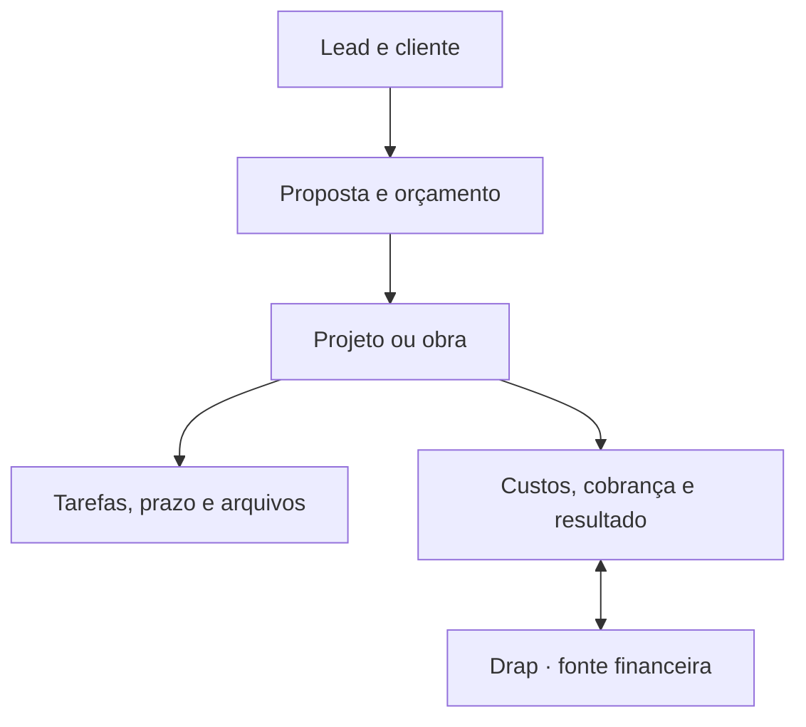

# H.OIKOS

> **H.OIKOS — Ecossistema para arquitetos.** Um SaaS objetivo para escritórios de arquitetura, engenharia, reformas e construção civil.

A interface segue o manual de identidade visual da marca. Os vetores em `public/brand/` são os contornos originais do manual, em cinco aplicações (símbolo, lettering, assinatura, versão empilhada e lockup horizontal), positivo e negativo. A paleta usa branco `#FFFFFF` como fundo predominante e preto `#000000`, marrom `#38301B`, acinzentado `#B5B19E`, off-white `#F7F7F0`, marrom quase preto `#1C190F`, off-white quente `#F4F2E9` e dourado `#846100` — este último reservado a acento, por ser a única cor de matiz diferente no guia. A tipografia usa a **Ador Hairline licenciada** nos títulos, servida de `public/fonts/` nos cinco pesos recebidos (Light, Black e três itálicos); a Cormorant fica como reserva. A Barium continua sem licença web e a Jost segue no lugar dela. Consulte [Identidade H.OIKOS](docs/HOIKOS-IDENTITY.md).

Este repositório contém uma fundação executável do produto: interface responsiva, criação e seleção de empresas, dados persistentes com isolamento multiempresa e integração financeira remota com a Drap.

O objetivo não é copiar a Vobi. O objetivo é reunir o ciclo do negócio em um fluxo menor, mais claro e mais previsível:



## O que já está no código

As planilhas possuem validação de preenchimento (listas, números, datas e obrigatoriedade), cores condicionais e resumos agrupados com soma, contagem, média, mínimo e máximo, exibidos como tabela ou gráfico de barras/linhas. Configurações são persistidas, ajustadas ao inserir/excluir e incluídas no desfazer/refazer. Valores inválidos impedem salvar também na API.

A grade tem formatação de texto por célula — negrito, itálico, sublinhado, tachado, alinhamento à esquerda/centro/direita, quebra de texto, cor do texto e preenchimento de uma paleta fixa — e mesclagem de células. Também ajusta a largura da coluna pela borda do cabeçalho (ou pelo teclado), fixa até duas colunas à esquerda, sugere funções ao digitar a fórmula, tem formato contábil com negativo em vermelho e imprime (ou salva em PDF) os valores calculados. Formatação e mesclagens acompanham inserir, excluir e ordenar linhas, entram no desfazer e são validadas na API.

O botão direito do mouse (ou a tecla Menu, Shift + F10 e o toque longo no celular) abre na grade as ações do Excel e do Google Planilhas: recortar, copiar, colar e colar especial (só valores, só formatação, transposto), inserir e excluir várias linhas ou colunas de uma vez, limpar conteúdo/formatação/tudo, ordenar, filtrar pelo valor da célula, formatar, mesclar, inserir nota, ocultar e reexibir linhas e colunas, ajustar largura ao conteúdo, fixar colunas, preencher para baixo e à direita, inserir SOMA e abrir validação e formatação condicional. Colar dentro da planilha leva fórmulas (com referências deslocadas como no Excel), estilos e notas; Delete limpa toda a seleção.

XLSX permite escolher uma aba e conferir a prévia antes de substituir os dados. Importa valores, resultados salvos de fórmulas, negrito, itálico, sublinhado, tachado, alinhamento, quebra de texto e mesclagens; não importa cores, macros, vínculos externos ou objetos. Exporta valores calculados, formatos de coluna, formatação de texto, cores, mesclagens e colunas fixas, com fórmulas originais em aba de referência textual. Limites: 4 MB comprimidos, 32 MB descomprimidos, 20 abas por arquivo, 20.000 células preenchidas no conjunto, 500 linhas e 52 colunas por aba. A exportação exige a revisão salva atual. O processamento usa ExcelJS no servidor; nenhum código dessa dependência entra no cliente.

- Revisão operacional de 20/09/2026: edição de clientes, oportunidades, projetos/obras e tarefas; reabertura e filtros de tarefas; linha do tempo; carga estimada por responsável; cópia de orçamento e proposta imprimível. Carregamento isolado por módulo, validação de datas/dependências e correção de upload. [Inventário, validação e pendências por módulo](docs/REVISAO-PLATAFORMA-2026-09-20.md).

- CAD revisado em 22/09/2026: seleção múltipla e por janela, mover/copiar/girar/escalar/apagar em grupo, linha/polilinha/retângulo por cliques, camadas criáveis e precisão fracionária nos gestos. Gravar mantém o histórico e preserva alterações feitas durante o envio. [Ferramentas e limites](docs/cad-implementation.md).

- CAD do editor próprio: linha de comandos, medidas fracionárias e importação NEXO, DXF e DWG (conversão local em WebAssembly, sem configuração externa obrigatória). [Comandos](docs/comandos-cad.md), [escopo implementado e pendências](docs/cad-implementation.md) e [como adicionar um formato](docs/adicionar-formato.md). A página `/formatos` informa a compatibilidade real; o CAD completo 2D/3D da especificação ainda está em implementação.

- Política Drap por empresa e módulo: preço oficial como mínimo, acréscimo opcional exclusivo do superadministrador, revisão concorrente e preço congelado por solicitação. Confirmação HMAC registra base, total e comissão mensal para conciliação; não comprova pagamento. Contratação real aguarda conclusão/homologação pela Drap, por orientação do responsável. Consulte [Ativação e controle](docs/DRAP-ACTIVATION.md).
- Painel “Visão geral” com prioridade do dia, indicadores, primeiros passos e listas reais de tarefas e projetos. Composição em branco, marrom e off-white, com profundidade e acentos dourados.
- Áreas navegáveis de projetos, obras, orçamentos, cronograma, Prancheta, Editor CAD, Criador de layout, Comunicação, CRM, financeiro, equipe, tarefas e arquivos.
- Central própria de cada projeto/obra, com resumo, planejamento, tarefas, custos e registros no mesmo contexto.
- Orçamentos reais com versões por projeto, BDI, margem, itens em lote e biblioteca própria da empresa.
- Financeiro contextual por obra, com centros de custo, contas, cobranças confirmadas pela Drap, lembretes e relatórios CSV.
- Diário de obra persistente, com atividades, clima, equipe, ocorrências, fotos privadas, histórico de correções e relatório para impressão/PDF. Atualização automática a cada 15 segundos nas telas visíveis, sem dados demonstrativos.
- Portal do cliente por obra, com convites vinculados ao e-mail, publicação seletiva de textos e fotos do diário, aprovações e solicitações de ajustes com histórico preservado.
- Contador de tempo online por dia para todos os acessos, medido no servidor, com histórico próprio para cada pessoa, visão da empresa para o contratante e visão de toda a plataforma para o superadmin. Consulte [Tempo de uso](docs/TEMPO-DE-USO.md).
- Dez modelos de planilha com objetivo definido — orçamento de obra, cronograma físico-financeiro, medição, apropriação de horas, quantitativos, compras, fluxo de caixa, resultado por centro, funil comercial e honorários por etapa —, cada um com fórmulas e papéis de coluna prontos. Consulte [Modelos de planilha](docs/MODELOS-DE-PLANILHA.md).
- Planilha de saúde financeira governada pelo superadmin: neutra até existir dado, depois aponta margem, preço a aumentar, peso dos colaboradores e em que setor a operação ganha ou perde. Consulte [Saúde financeira](docs/SAUDE-FINANCEIRA.md).
- Planilha com fórmulas em português e documento com campos calculados, sobre os dados reais da empresa, com importação de orçamentos, projetos, clientes e tarefas. Consulte [Planilha e documento](docs/PLANILHA-E-DOCUMENTO.md).
- Lembretes diários para todos os acessos — cobranças a confirmar, boletos a vencer, follow-ups do funil, tarefas com prazo, recados com data criados na Comunicação e metas em aberto — com metas cujo realizado é calculado a partir dos dados reais. Consulte [Lembretes e metas](docs/LEMBRETES-E-METAS.md).
- Prancheta (24/09/2026): biblioteca de arquivos de projeto que abre no navegador DWG e DXF (camadas, fundo claro/escuro, medição), PDF (páginas sob demanda e zoom), IFC em 3D, STL, OBJ, glTF/GLB, PLY e 3MF, DOCX, XLSX e CSV, imagens, vídeo, áudio e texto (IES, LDT, JSON, XML, STEP). Converte DWG → DXF no servidor (LibreDWG) e, no navegador, desenho → PDF vetorial (A4 a A0, cores ou preto e branco) / SVG / PNG, PDF → PNG ou JPG e imagem → PDF sem perda; o resultado entra na biblioteca ligado ao original. Formatos sem visualização (RVT, SKP, DGN, PPTX…) ficam guardados no original e dizem o motivo. Arquivos até 150 MB, enviados e baixados em partes cifradas de 3 MB. Consulte [Prancheta e Comunicação](docs/PRANCHETA-E-COMUNICACAO.md).
- Comunicação (24/09/2026): canal Geral e canais criados pela equipe, conversas diretas entre duas pessoas da mesma empresa, anexos no formato original (enviados do computador ou da Prancheta, sem cópia), visualização do anexo sem baixar, edição e exclusão da própria mensagem, contador de não lidas no menu e lembretes com data para uma pessoa ou para a conversa, que aparecem em Lembretes do dia até alguém marcar como feito. Reenviar depois de falha de rede não duplica a mensagem. Atualização a cada 4 segundos com a aba visível.
- Criador de layout (24/09/2026): planta com paredes, cômodos com piso, portas, janelas e portão de garagem, e um catálogo de 121 itens na medida de mercado — sofás, camas, mesas, armários, eletrodomésticos, balcões (americano, de bar, ilha gourmet, de atendimento) com banquetas, móveis de alvenaria (balcão, bancadas, churrasqueira, banco, sofá, cama, mureta, floreira, nichos, lareira), louças de banheiro, som ambiente e home cinema, ar-condicionado, cortinas e persianas, carros (hatch, sedã, SUV, picape, esportivo, elétrico, minivan), moto, scooter, carregador, bancada de ferramentas, vagas, árvore, piscina e pergolado. Mesas, bancadas, balcões e marcenaria têm acabamento escolhido por peça (madeira, vidro, mármore, granito, quartzo, laca, metal ou concreto), visível na planta e no 3D. Prévia 3D ao vivo com paredes levantadas, aberturas, pisos com textura e sombra. Exporta imagem 3D, planta humanizada e prancha de proposta em PDF (A3) direto para a Prancheta, prontas para enviar pela Comunicação. Parte de modelos (casa térrea com garagem, apartamento compacto) ou do zero; salvar exige a versão aberta, então duas pessoas não se sobrescrevem. Consulte [Criador de layout](docs/CRIADOR-DE-LAYOUT.md).
- Editor CAD (de volta ao menu em 24/09/2026, item "Editor CAD"): desenho técnico dentro da plataforma, em milímetros e em camadas — a mesma planta serve como layout, elétrico, luminotécnico ou mobiliário sem redesenhar. Paredes, cômodos com área calculada do polígono, portas, janelas, passagens, símbolos elétricos e de iluminação, mobiliário, imagens, textos, cotas, linhas, polilinhas, retângulos, círculos, arcos e traço livre; desfazer e refazer, Ctrl+S para gravar, quantitativo derivado do desenho e exportação em SVG, PNG, NEXO e DXF (com cores e tipos de linha das camadas). Encaixe em extremo, interseção, perpendicular, meio, centro, quadrante, tangente e mais próximo, com índice espacial para não travar em desenho grande; trava ortogonal, arrasto de vértice e medidas digitadas (`3150`, `3150<90`, `@3000,1500`, `3,15m`). Aparar como no AutoCAD: clica-se no pedaço que deve sumir e ele é cortado entre as linhas que o cruzam — polilinha cortada no meio vira duas, círculo vira arco, e o vizinho não se deforma; estender leva só a ponta até a primeira linha no caminho. Espelhar mantém o texto legível. Fundo escuro opcional, como o espaço do modelo do AutoCAD. Importação de DWG e DXF com TODAS as camadas da tabela do arquivo — inclusive vazias —, com cor, tipo de linha e estado (desligada ou congelada entra escondida, travada entra travada); blocos com escala, giro, espelhamento, matriz (MINSERT) e herança da camada 0; polilinhas antigas e com arcos, elipses, splines, hachuras (sólidas e com padrão), sólidos, textos alinhados, MTEXT em várias linhas com acentos, atributos, cotas e linhas múltiplas. O que não entra (espaço de papel, sólidos 3D, imagens) aparece no relatório com nome e contagem, e a unidade é confirmada antes de o desenho entrar. Arquivo grande vai antes para a biblioteca da Prancheta, em partes, e desenho grande trafega e é gravado comprimido (até 80 mil elementos e 1.000 camadas). Um DWG da biblioteca abre no editor pelo botão "Editar no Editor CAD". Consulte [Editor CAD](docs/EDITOR-CAD.md).
- Parâmetros normativos escritos no código com o item exato da norma — NBR 5410 (pontos de tomada, iluminação e carga mínima) e NBR 9050 (vão livre de porta, módulo de referência, faixas de circulação) —, e conferência do desenho contra eles: a plataforma calcula da área e do perímetro quantas tomadas e pontos de luz cada cômodo exige e aponta o que falta, sem alterar o desenho. Uma rotina do superadministrador busca a página oficial de cada norma e avisa quando ela muda; nenhum caminho automático altera parâmetro — a revisão é humana, como no SINAPI. Preço e índice não moram aqui: vêm da ingestão real do SINAPI.
- Interface responsiva, com menu recolhível e busca. Cada aba abre com uma fotografia própria do trabalho que ela serve, em duas camadas que dissolvem antes de alcançar tabela ou número.
- Fluxo de criação rápida preparado para virar formulários reais.
- Interface conectada somente a dados reais da empresa ativa, com estados vazios explícitos.
- Esquema relacional multiempresa em `db/schema.ts`.
- Backend multiempresa para sessão, onboarding, membros e CRUD de clientes, projetos e tarefas.
- Um só formulário de entrada para todos: o servidor reconhece pelas credenciais se é conta de empresa ou o superadministrador (protegido por hash, sessão assinada e bloqueio de tentativas repetidas) e leva cada um ao seu painel. `/superadmin` sem sessão manda para esse mesmo formulário.
- Cliente convidado ao portal cria a própria senha pelo link do convite. Convite de equipe ou de portal nunca troca a senha de um e-mail que já tem conta: a pessoa entra com a dela e aceita.
- Superadmin com poder total: cadastra empresas, abre qualquer empresa com leitura e edição em todos os módulos e ignora bloqueio de acesso, assinatura pendente e aceite de termos. Consulte [Superadministrador](docs/SUPERADMIN.md).
- Convite principal do superadmin para o contratante e convites secundários administrados dentro de cada empresa.
- Perfis para administrador, gestor, colaborador, parceiro, prestador, financeiro e contabilidade, com matriz de leitura/edição por módulo.
- Termos de Uso versionados e aceite eletrônico com evidência original preservada. Nova [minuta jurídica para a futura operadora](docs/TERMOS-HOIKOS-2026-09-20.md) em `/termos/proposta`, sem vigência nem coleta de aceite. A Drap desenvolve para venda à adquirente; não foi identificada como operadora H.OIKOS.
- Painel do superadmin com indicadores agregados da plataforma e entrada direta em qualquer empresa, registrando a entrada e cada escrita na auditoria daquela empresa.
- Acesso de administrador de manutenção em `/manutencao`, com credenciais próprias e ambiente empresarial vazio e isolado. O superadmin opera o mesmo ambiente pela sessão da plataforma, com recursos que a manutenção não tem.
- Identidade e organização resolvidas no servidor pelos cabeçalhos autenticados da plataforma.
- Permissões por papel e trilha de auditoria para todas as escritas do núcleo operacional.
- Adaptador financeiro exclusivamente no servidor em `lib/integrations/drap.ts`.
- Endpoint financeiro sem fallback fictício: ausência ou falha da Drap aparece como indisponibilidade.
- SINAPI com análise no superadmin, importação retomável, renovação mensal para a UF/regime configurados e descarte da referência anterior após a troca. Consulta local nos orçamentos, com regime explícito. **Homologação da planilha real ainda pendente: a Caixa respondeu HTTP 403 ao servidor publicado e HTTP 429 ao download local.** Consulte [Referência SINAPI](docs/SINAPI-INTEGRATION.md).
- Webhook Drap com verificação HMAC SHA-256, identificação da empresa e idempotência pelo ID do evento.
- Instruções permanentes para o Claude Code em `CLAUDE.md`.

## Princípios do produto

1. **A primeira tela é uma fila de decisões.** Mostrar o que venceu, bloqueia prazo, afeta caixa ou depende do usuário.
2. **Uma informação tem um único dono.** A Drap é a fonte financeira; esta aplicação é a fonte de projetos, obras, tarefas e documentos.
3. **Contexto antes de módulo.** O usuário entra em um projeto e encontra escopo, cronograma, orçamento, documentos, horas e financeiro relacionados.
4. **Exceção antes de relatório.** O sistema destaca desvios e deixa o detalhamento a um clique.
5. **Cadastro progressivo.** Pedir apenas o necessário em cada etapa; campos avançados aparecem quando passam a ser úteis.
6. **Nenhuma tela sem ação clara.** Cada página deve responder “o que devo fazer agora?”.
7. **Sem conteúdo ornamental.** Nada de cards redundantes, textos de apresentação dentro do produto ou menus criados apenas para parecer completo.

## Módulos e escopo

| Módulo | Fluxo principal | Primeira entrega real |
| --- | --- | --- |
| Visão geral | Entender o dia e agir | Prioridades, desvios, próximos marcos e caixa |
| CRM e clientes | Lead até fechamento | Funil, histórico, próximo contato e conversão em projeto |
| Orçamentos | Custo até aceite | Composições, BDI, margem, versões, proposta e aprovação |
| Projetos | Briefing até entrega | Etapas, entregáveis, horas, responsáveis e resultado |
| Obras | Planejamento até encerramento | Diário, fotos, compras, medições, ocorrências e avanço |
| Cronograma | Planejar e recalcular | Gantt, dependências, responsáveis e previsto x realizado |
| Tarefas | Executar sem perder contexto | Prioridade, checklist, dependência, prazo e apontamento |
| Equipe | Distribuir capacidade | Papéis, permissões, carga e horas planejadas x realizadas |
| Arquivos | Encontrar a versão certa | Pastas por projeto, revisão, metadados e acesso do cliente |
| Prancheta | Abrir e compartilhar qualquer arquivo de projeto | DWG, DXF, PDF, IFC, 3D, Office e imagens no navegador, com conversões reais para a biblioteca |
| Editor CAD | Desenhar e editar a planta técnica em camadas | DWG e DXF com todas as camadas, ferramentas de CAD, quantitativo e exportação DXF/SVG |
| Criador de layout | Mostrar ao cliente como o espaço vai ficar | Planta com móveis, eletrodomésticos e veículos, prévia 3D e prancha de proposta |
| Comunicação | Falar com a equipe sem sair da plataforma | Canais, conversas diretas, anexos no original e lembretes com data |
| Tempo de uso | Saber quanto tempo cada acesso ficou online | Total por dia, sessões, ações e histórico por pessoa |
| Planilha e documento | Somar sem sair da plataforma | Fórmulas em português sobre dados reais, com exportação |
| Lembretes do dia | Saber o que exige ação hoje | Cobranças, boletos, follow-ups, prazos e metas por acesso |
| Financeiro | Ver resultado no contexto | Saldo, contas, caixa e resultado por projeto vindos da Drap |

## Stack escolhida

- TypeScript, React 19 e Next.js 16 compatível com Vinext.
- Tailwind CSS 4 e componentes acessíveis do catálogo Shadcn já incluído.
- Drizzle ORM com SQLite/D1 para os dados operacionais.
- R2 para arquivos binários e D1 para seus metadados.
- API REST interna com validação Zod.
- `fetch` no servidor para a integração remota com a Drap.
- Web Crypto para validação de webhooks.

A arquitetura pode ser adaptada pelo Claude Code para Postgres, Supabase, Neon ou outro provedor. O domínio e os limites entre módulos devem permanecer os mesmos.

## Como abrir no Claude Code

Pré-requisitos: Node.js 22.13 ou superior e npm.

```bash
cd nexo-obra
npm ci
cp .env.example .env
npm run dev
```

Depois, abra a pasta no Claude Code e use este primeiro comando:

```text
Leia CLAUDE.md e README.md por completo. Preserve a arquitetura multiempresa e o limite da integração Drap. Primeiro execute o build e corrija apenas erros reais. Depois implemente a Fase 1 do roadmap, começando pelo fluxo autenticado organização → cliente → projeto → tarefa. Faça mudanças pequenas, valide ao final de cada fatia e atualize o README quando o estado do produto mudar.
```

Comandos úteis:

```bash
npm run dev
npm run build
npm run lint
npm run typecheck
npm test
npm run db:generate
```

Os testes cobrem regra de negócio, autorização, cálculo e interface. Consulte [Testes de interface](docs/TESTES-DE-INTERFACE.md).

## Primeiro acesso e atualização do banco

O `db:generate` apenas escreve as migrações em `drizzle/`; **nada no deploy as aplica**. Ao
publicar uma versão com migração nova, entre em `/superadmin` e use **Atualizar banco de
dados** — o aviso aparece no topo do painel, com o que falta aplicar, e continua visível
mesmo quando o resto do painel falha por causa das tabelas ausentes. Consulte
[Atualizar o banco de dados](docs/ATUALIZAR-BANCO.md).

Sem isso, as áreas que dependem das tabelas novas respondem `503` com o código
`database_not_migrated`.

## Repositório e publicação

- O código-fonte oficial fica em [empresaexemplo9-gif/Nexo-obra](https://github.com/empresaexemplo9-gif/Nexo-obra).
- O domínio oficial é [nexo-obra-jet.vercel.app](https://nexo-obra-jet.vercel.app) e agora **compila o repositório**: o `vercel.json` declara `framework: nextjs` e `buildCommand: npm run build` (`next build`). Enviar commit para `main` publica.
- Antes não era assim: o `buildCommand` era vazio e todas as rotas eram reescritas para o alvo do OpenAI Sites. Isso fez uma sequência inteira de funcionalidades parecer não existir. Confirme em `/superadmin` que **Versão no ar** mostra o commit esperado. Consulte [Publicação](docs/PUBLICACAO.md).
- Sair daquele alvo exigiu trocar D1 por libSQL/Turso, `cloudflare:workers` por `process.env`, o bucket R2 pelo Vercel Blob e `import.meta.glob` por um manifesto gerado. `vinext`, `wrangler` e `@cloudflare/vite-plugin` saíram do projeto.
- As fotos e documentos sobem como objeto **privado** no Vercel Blob e ainda cifrados em AES-256-GCM: a URL sozinha não devolve nada sem o token, e um objeto que escape do armazenamento devolve bytes inúteis. Gere a chave com `npm run media:key`.
- Tokens, chaves e segredos de produção devem ser configurados nos ambientes de publicação. Eles não pertencem ao Git nem ao arquivo de hosting.
- O ambiente antigo do OpenAI Sites foi exportado e conferido: o código publicado lá tem a mesma árvore do commit `8f82b3e` deste histórico, e o banco daquele ambiente não tinha registro de negócio nenhum. Não há nada a restaurar dele. Consulte [Exportação do Sites](docs/EXPORTACAO-SITES.md).

## Configuração da Drap

Crie `.env` a partir de `.env.example`:

Gere o hash da senha administrativa com `npm run superadmin:hash -- "sua senha"`. Ele sai com **dois-pontos** como separador de propósito: painéis de publicação expandem `$` e mutilam o hash sem avisar, fazendo o login recusar a senha correta. Detalhes em [Publicação](docs/PUBLICACAO.md).

```dotenv
DRAP_API_URL=https://empresa.drap.app.br
DRAP_API_TOKEN=token_de_servico
DRAP_API_KEY_HEADER=
DRAP_SUMMARY_PATH=/api/v1/resumo
DRAP_TRANSACTIONS_PATH=
DRAP_CHARGES_PATH=
DRAP_WEBHOOK_SECRET=segredo_compartilhado

# Conexão automática: cria a empresa na Drap e guarda a chave dela aqui, cifrada.
DRAP_PARTNER_TOKEN=drap_partner_...
SECRETS_ENCRYPTION_KEY=32_bytes_em_base64
```

Gere a chave de cifra com `npm run segredos:key`. Ela protege a credencial de cada
empresa no banco e é **separada** da `MEDIA_ENCRYPTION_KEY` das fotos de propósito:
propósitos diferentes, prazos de rotação diferentes. Trocar esta chave torna ilegíveis as
credenciais já guardadas — as empresas precisam reconectar.

### O motor financeiro é invisível

O plano e o valor são da H.OIKOS. Para quem usa a plataforma, a Drap não aparece: não há
preço dela na tela, não há link para o produto dela, e não há como sair daqui para lá.
Mandar alguém para outro produto no meio do trabalho seria anunciar um fornecedor que não
é problema do cliente.

O que a plataforma consulta é binário: esta empresa pode emitir nota, ou não pode. Isso
entra em `capabilities.notas`, junto de resumo, contas e cobranças — e sem isso a pessoa
só descobriria a indisponibilidade tentando emitir e levando erro, na frente do cliente
dela. A consulta que falha vira `false`, nunca exceção: o Financeiro inteiro não pode cair
porque o motor não respondeu sobre um recurso que talvez nem seja usado hoje.

Vincular uma empresa que já existe na Drap continua possível, por um link de texto abaixo
do formulário. Ele não tem o mesmo peso de "criar empresa" de propósito: quase todo mundo
que chega ali não tem conta e nem precisa saber que existe uma, e duas opções lado a lado
obrigavam a escolher entre uma coisa que a pessoa quer e outra de que ela nunca ouviu
falar.

### Nota fiscal de serviço

Emitir sai da obra: o serviço, o valor e o cliente já estão ali, e o cliente da obra é o
tomador da nota. Sem esse vínculo financeiro a emissão é recusada aqui mesmo — inventar um
tomador seria falsificar documento fiscal.

A tela nunca diz "nota emitida" no momento do pedido. Quem autoriza é a prefeitura, e a
resposta dela vem depois: o pedido entra como *processando* e vira *autorizada* quando a
confirmação chega. A listagem confere a situação real numa consulta só e, quando ela
falha, mostra o que se sabia junto da data — "confirmado em", nunca uma situação que
ninguém conferiu.

Dois desfechos de erro ficam separados de propósito:

- **Recusada** — o serviço fiscal respondeu que não emitiu, e o motivo dele aparece na
  tela (cadastro fiscal faltando, município que exige CNAE, franquia esgotada);
- **Não confirmada** — a conexão caiu no meio e ninguém sabe se a nota saiu. Aqui a tela
  oferece **Verificar**, que reenvia a **mesma** chave de idempotência: o serviço fiscal
  reconhece a tentativa anterior e devolve a nota de antes em vez de emitir a segunda.
  Tratar este caso como "não emitida" seria o caminho mais curto para duas notas pelo
  mesmo serviço — e duas notas só se desfazem com cancelamento, que tem prazo e
  justificativa.

Os dados fiscais da empresa (incluindo o certificado A1, que atravessa sem ficar guardado
aqui) são cadastrados em **Dados fiscais**, no topo do Financeiro.

### Credencial da empresa

A chave de cada empresa nasce com um conjunto fixo de acessos. Quando a plataforma passa a
usar um recurso novo — emitir nota, por exemplo — as empresas conectadas antes continuam
com a chave antiga, que não alcança esse recurso.

Reconectar não resolve: a empresa já existe do outro lado, o pedido repetido devolve a
mesma empresa e a chave não vem de novo. Por isso a tela de conexão distingue "não está no
plano" de "a credencial não alcança" e oferece **Atualizar credencial**, que pede outra
chave sem tocar na empresa nem no histórico dela.

### Avisos automáticos

Conectar uma empresa também registra, sozinho, o webhook dela na Drap. Sem isso o
Financeiro só descobria lançamento novo quando alguém abria a tela, e ligar o aviso exigia
um humano colar URL e copiar segredo no painel da Drap, empresa por empresa — o mesmo
"segundo login adiado" que o provisionamento existe para eliminar.

Para isso funcionar, a instalação precisa saber o próprio endereço público: `HOIKOS_PUBLIC_URL`,
ou o domínio de produção que a Vercel preenche sozinha. O endereço **não** é derivado do
cabeçalho `Host` da requisição — esse cabeçalho vem do cliente, e aceitá-lo deixaria quem
conecta escolher para onde o financeiro da empresa é enviado.

A assinatura cobre só os eventos que a plataforma trata (`lancamento.*` e `cobranca.*`).
O segredo devolvido pela Drap aparece uma vez e vai cifrado para o banco, junto da chave
da empresa; é com ele que o receptor confere o `X-DRAP-Signature` de cada entrega.

Quando o registro falha — Drap fora do ar, endereço público ausente, chave sem o escopo
`webhooks:*` — a conexão continua válida e a tela diz que a empresa ficou sem avisos
automáticos, com um botão para tentar de novo. Conexão parcial nunca é apresentada como
completa.

### Importante

A Drap publica a API em `https://empresa.drap.app.br/api-docs`. Lançamentos, parceiros, categorias, resumo financeiro, cobranças e webhooks estão confirmados, com autenticação por chave de tenant, escopos por recurso e webhooks assinados. O provisionamento de empresa sem login humano existe na API de parceiro da Drap (`/api/partner/v1`).

Por isso:

- o resumo financeiro vem somado pela Drap em `/api/v1/resumo`; quando o endpoint não existe no ambiente, a H.OIKOS soma pelos lançamentos e marca o total como parcial em vez de exibi-lo como completo;
- o token nunca é enviado ao navegador nem entra em variável `NEXT_PUBLIC_*`;
- a chave resolve o tenant no servidor da Drap; a H.OIKOS nunca envia identificador de empresa na chamada;
- o adaptador aceita nomes de campos comuns em português e inglês, mas deve ser ajustado ao JSON oficial;
- enquanto a credencial real não for homologada, a tela informa que a integração está indisponível, sem fabricar valores;
- nenhuma escrita financeira é liberada antes da homologação com chave real.

### Conectar uma empresa

Com `DRAP_PARTNER_TOKEN` e `SECRETS_ENCRYPTION_KEY` configurados, quem administra a
empresa conecta pela própria H.OIKOS, em Financeiro → Conexão DRAP:

- **Criar empresa** — a empresa ainda não existe na Drap. A plataforma cria e guarda a
  chave dela, cifrada. O documento (CNPJ/CPF) é o que impede empresa duplicada lá.
- **Já uso a Drap** — a empresa existe. O administrador dela gera um código em
  Configurações → Integrações, dentro da Drap, e cola aqui. O código vale uma vez, por 15
  minutos, e é a única prova de consentimento: sem ele, saber um CNPJ bastaria para passar
  a operar o financeiro de alguém.

A chave nunca chega ao navegador nem ao log. `DRAP_TENANTS_JSON` continua funcionando e
tem precedência sobre o que está no banco — é a saída de emergência.

O vínculo por identificador manual fica restrito ao superadministrador. Uma chave legada
`DRAP_API_TOKEN` exige `DRAP_LEGACY_COMPANY_ID` correspondente; ela não autoriza outras
empresas. Em Soluções Drap, o painel de preparação mostra configurações e permite uma
consulta explícita de leitura da API. O [roteiro de entrega](docs/DRAP-ENTREGA-INTEGRACAO.md)
registra os contratos implementados, as dependências da Drap e os critérios de homologação.

### Homologar a credencial

```bash
DRAP_API_TOKEN=drap_live_... npm run homologar:drap
```

O roteiro completo — pré-requisitos, preset de escopo correto e o que cada falha significa — está em [Homologação da credencial Drap](docs/HOMOLOGACAO-DRAP.md). O contrato recomendado segue em `docs/DRAP-INTEGRATION.md`, e o que falta pro cadastro sem segundo login, em `docs/DRAP-ACTIVATION.md`.

## Divisão de responsabilidade dos dados

| Dado | Fonte oficial | Uso na H.OIKOS |
| --- | --- | --- |
| Clientes | H.OIKOS, com ID remoto opcional | CRM, projeto, obra e proposta |
| Projetos e obras | H.OIKOS | Contexto central de operação |
| Tarefas, horas e cronograma | H.OIKOS | Planejamento e execução |
| Orçamentos técnicos e versões | H.OIKOS | Composição, BDI, margem e aceite |
| Arquivos e revisões | H.OIKOS | R2 + metadados no banco |
| Lançamentos, contas e saldo | Drap | Consulta remota e vínculo por centro de custo |
| Cobranças, PIX, boleto e nota | Drap | Acionamento remoto após confirmação |
| DRE e conciliação | Drap | Leitura e contextualização por projeto |

## Acesso e senha

A autenticação é da própria plataforma: senha com PBKDF2-SHA256 (100.000 iterações, sal por
senha) e sessão em cookie `__Host-nexo-session` assinado com HMAC-SHA256. O cadastro
acontece no link de convite — a pessoa escolhe a senha ali, e o aceite já devolve a sessão
aberta. A volta é por `/entrar`.

Os cabeçalhos `oai-authenticated-user-*` deixaram de ser identidade por padrão. Eles só
valem quando a hospedagem declara `TRUST_IDENTITY_HEADERS=true`, porque fora de uma borda
que os sobrescreva qualquer visitante pode enviá-los e se passar por outra pessoa.
Configure `SESSION_SECRET` com pelo menos 32 caracteres. Consulte
[Acesso e senha](docs/ACESSO-E-SENHA.md).

## Apagar empresa, conta e convite

Na tela do superadministrador. Exclusão é irreversível, então a confirmação pede para
**digitar o nome** do que vai sair: um "tem certeza?" com botão de OK é acertado por
reflexo, e a diferença entre errar a linha da tabela e não errar é justamente olhar qual
item está selecionado.

**Empresa.** Sai com tudo que pendurava nela. A lista de tabelas não é escrita no código:
vem do próprio banco, porque uma lista à mão fica desatualizada exatamente na tabela nova
que ninguém lembrou — e o que sobra é linha órfã apontando para uma empresa que não
existe mais. Duas tabelas deste projeto provam o ponto: `audit_events` e
`organization_members` guardam dado de empresa, estão vivas e **não existem em
`db/schema.ts`**. A ordem das exclusões também sai do banco, das chaves estrangeiras:
filha antes da mãe, senão o SQLite recusa. Tudo num `batch`, que é transacional — meia
empresa apagada é pior do que nenhuma, porque ninguém sabe o que sobrou.

**A Drap vem primeiro.** A empresa existe dos dois lados e só a conexão guardada aqui sabe
qual é qual. Apagando daqui primeiro, essa ligação some: a empresa fica viva lá sem
ninguém que saiba o que ela era, e o documento dela continua ocupado. A Drap recusa apagar
empresa que ela não provisionou ou que tem gente acessando direto — a recusa para tudo,
com o motivo, e a segunda pergunta oferece apagar só daqui dizendo o preço.

**Conta.** Apagar remove a pessoa de todas as empresas e o login dela. O que ela cadastrou
**fica**: tarefa, diário de obra e orçamento pertencem à empresa, não a quem digitou.
Quem só pertencia à empresa apagada perde o login junto — conta sem empresa nenhuma entra
e vê uma tela vazia, sem saber se perdeu acesso ou se o produto quebrou.

**Convite.** *Revogar* queima o link e mantém a linha, porque "este acesso foi oferecido e
cancelado" é informação. *Remover* apaga a linha, e só alcança convite que já não abre:
apagar um convite ainda válido deixaria o link vivo e invisível.

**O rastro sobrevive.** `platform_audit_events` exige `organization_id` apontando para uma
empresa viva, então o registro de "esta empresa foi apagada" sairia junto no cascade — a
ação mais destrutiva do produto seria a única sem rastro. Por isso existe
`platform_deletions`, sem chave estrangeira nenhuma, guardando o nome legível de quem
saiu e quem mandou apagar.

## Modelo multiempresa

Toda tabela operacional carrega `organization_id`. Nunca aceite o identificador de organização informado apenas pelo cliente. A API deve derivá-lo da sessão autenticada e verificar a associação do usuário no servidor.

As APIs não aceitam `organization_id` do navegador. A identidade autenticada é associada a um membro no servidor e todas as consultas recebem o `organization_id` dessa associação.

O administrador de manutenção utiliza uma organização interna reservada, criada vazia no primeiro acesso, seja dele ou do superadmin. A resolução de sessão força esse acesso exclusivamente à organização de manutenção, mesmo que o mesmo e-mail participe legitimamente de outra empresa. Ele não pode aceitar convites de clientes, criar empresas contratantes nem alcançar o painel da plataforma. Esse ambiente não entra nas contagens de empresas do superadmin e nunca é o destino padrão dele.

O backend inicial está documentado em [`docs/BACKEND.md`](docs/BACKEND.md).

Papéis mínimos recomendados:

- `superadmin`: titular da plataforma, com leitura e edição totais em qualquer empresa; não ocupa vaga de equipe e só é alcançado pela sessão assinada de `/superadmin`;
- `owner`: cobrança, integrações, segurança e acesso total;
- `admin`: equipe, configurações e operação total, sem propriedade da assinatura;
- `manager`: projetos, obras, orçamentos e relatórios;
- `member`: itens atribuídos e módulos liberados;
- `partner`: acesso limitado a projetos específicos;
- `service_provider`: execução operacional com escopo definido pelo contratante;
- `finance`: acesso financeiro configurável para a equipe responsável;
- `accounting`: prestação de contas com leitura ou edição explicitamente liberada;
- `client`: portal externo somente para leitura/aprovação/comentário.

Os papéis são apenas modelos iniciais. A autorização efetiva é a matriz `permissions_json` do membro, validada nas rotas do servidor. Ninguém libera mais do que tem: um `admin` sem acesso ao Financeiro não consegue criar um convite com Financeiro liberado. Somente o `owner` e o superadmin, que já têm tudo, escapam dessa checagem. O papel `superadmin` é a única exceção: sua matriz é sempre total e é resolvida no servidor a partir da sessão administrativa, nunca do navegador. Marcar edição também concede a leitura necessária. Somente o `owner` ou um `admin` com permissão de edição em Equipe pode criar e revogar convites secundários.

O texto público vigente fica em `/termos`. Cada aceite grava a versão, data e evidências técnicas transformadas em hash, sem armazenar IP ou agente do navegador em formato bruto. Antes da cobrança comercial, o documento deve receber revisão jurídica e os dados legais do fornecedor, canal de privacidade e condições comerciais do plano.

## Estrutura do projeto

```text
app/
  api/
    clients/            # CRUD de clientes
    budget-library/     # produtos e serviços padronizados da empresa
    budgets/            # versões, composições e importação em lote
    diary/              # diário, revisões, fotos privadas e relatórios
    integrations/drap/  # proxy financeiro e webhook
    members/            # equipe da empresa atual
    maintenance/        # sessão do administrador em ambiente isolado
    invitations/        # leitura e aceite de convite individual
    organization-invitations/ # convites secundários e permissões da empresa atual
    onboarding/         # criação segura da primeira empresa
    projects/           # CRUD de projetos e obras
    session/            # identidade e organização ativas
    superadmin/         # sessão, visão global, cadastro de empresas e convites
    tasks/              # CRUD de tarefas
    terms/              # aceite eletrônico da versão vigente
  layout.tsx
  page.tsx
  projetos/[projectId]/ # central contextual de cada projeto ou obra
  superadmin/           # painel global protegido
  convite/              # criação de acesso por link
  termos/               # Termos de Uso públicos e versionados
components/
  nexo-app.tsx          # protótipo funcional dos módulos
  ui/                   # primitivas acessíveis
db/
  index.ts              # acesso centralizado ao banco
  schema.ts             # modelo relacional multiempresa
docs/
  DRAP-INTEGRATION.md
  SINAPI-INTEGRATION.md
  DIARIO-DE-OBRA.md
  EXPORTACAO-SITES.md
lib/
  integrations/drap.ts
  server/backend.ts       # identidade, organização, permissões e auditoria
drizzle/
  manifest.ts          # SQL das migrações embutido no bundle (gerado)
hooks/
public/
scripts/
tests/
vendor/
CLAUDE.md
```

## Roadmap de implementação

### Fase 1 — núcleo operacional

- Autenticação da plataforma e resolução segura da organização. **Concluído no backend.**
- Superadmin, convite do contratante e convites secundários com permissões granulares. **Concluído.**
- Operação completa da plataforma pelo superadmin, com auditoria por empresa. **Concluído.**
- CRUD de clientes, projetos e tarefas. **Concluído no backend.**
- Permissões de leitura/edição por módulo no servidor e auditoria de escritas. **Concluído no backend.**
- Termos versionados e aceite eletrônico obrigatório. **Concluído; revisão jurídica pendente antes da monetização.**
- Interface conectada às queries reais. **Concluído.**
- Central do ciclo de cada projeto/obra. **Concluída para dados-base, tarefas e resumo financeiro da empresa; conexões detalhadas seguem nas fases seguintes.**
- Versões de orçamento, itens, cálculo, biblioteca e inclusão em lote. **Concluído.**
- Testes de isolamento entre duas organizações.

### Fase 2 — comercial e orçamento

- Funil configurável e histórico de atividades.
- Conversão de oportunidade em projeto/obra com o cliente existente. **Implementada, com edição do seguimento comercial.**
- Biblioteca de serviços, insumos e composições. **Concluída para cadastro próprio.**
- BDI, margem e versões numeradas. **Implementados, com bloqueio após envio e cópia para novo rascunho.**
- Proposta para impressão/PDF. **Implementada.** Aceite digital do cliente vinculado ao orçamento permanece pendente; registrar aprovação interna não substitui esse aceite.
- Importação SINAPI dentro da plataforma e renovação automática implementadas para a UF/regime configurados; ativação inicial exige conferência do arquivo real no superadmin. Veja [SINAPI](docs/SINAPI-INTEGRATION.md).

### Fase 3 — planejamento e obra

- Datas, estimativa, dependência única e linha do tempo. **Implementadas, com recusa de ciclos e vínculos entre projetos.** Recálculo de rede, calendário útil e caminho crítico permanecem pendentes.
- Diário de obra com fotos, clima, equipe, ocorrências, histórico e relatórios. **Concluído; assinatura do cliente permanece pendente.**
- Medições, compras, fornecedores e previsto x realizado.
- Cronograma físico-financeiro e curva S.
- Portal enxuto do cliente. **Implementado: acesso por obra, convites, avanços autorizados, publicações e fotos selecionadas, aprovações e ajustes.**

### Fase 4 — financeiro remoto e automações

- Conector Drap homologado em sandbox.
- Vínculo de projeto com centro de custo remoto, recortado no servidor da Drap pelo campo `centro_custo` do lançamento. Obra sem movimento e centro de custo que não casa aparecem como casos diferentes na tela. **Concluído no produto; homologação Drap pendente.**
- Leitura de saldos e contas por projeto, com relatório CSV. Os totais vêm somados pela Drap, com plano B local declarado como parcial. **Concluída no produto; homologação Drap pendente.**
- Criação remota de cobrança com idempotência e política de lembretes. A cobrança sai na conta Asaas da própria empresa; os lembretes são da H.OIKOS. **Concluída no produto; homologação Drap pendente.**
- Processador assíncrono de webhook, reconciliação e tela de falhas.
- Alertas úteis: atraso, caixa negativo, margem baixa e tarefa bloqueadora.

## Critérios mínimos antes de produção

- Autenticação, autorização e isolamento multiempresa testados.
- Tokens e segredos somente no servidor e no gerenciador de segredos.
- Rate limiting em autenticação, uploads, criação e webhooks.
- Trilha de auditoria sem dados sensíveis desnecessários.
- Backup, restauração e exportação da conta validados.
- Webhooks com assinatura, idempotência, reprocessamento e dead-letter queue.
- Uploads com limite de tamanho, MIME permitido e varredura de segurança.
- LGPD: base legal, retenção, exclusão, portabilidade e registro de consentimento.
- Monitoramento de erro, latência, sincronização e saúde da integração.
- Teste de acessibilidade e uso real em celular no canteiro.

## Referências funcionais

O recorte funcional foi elaborado a partir das páginas públicas informadas no briefing:

- [Gestão de projetos](https://www.vobi.com.br/funcionalidades/gestao-de-projetos)
- [Gestão de obras](https://www.vobi.com.br/funcionalidades/gestao-de-obras)
- [Orçamento de obra](https://www.vobi.com.br/funcionalidades/orcamento-de-obra)
- [Gestão financeira](https://www.vobi.com.br/funcionalidades/gestao-financeira)
- [Gestão de vendas](https://www.vobi.com.br/funcionalidades/gestao-de-vendas)
- [Gestão de equipes](https://www.vobi.com.br/funcionalidades/gestao-de-equipes)
- [Gestão de arquivos](https://www.vobi.com.br/funcionalidades/gestao-de-arquivos-arq)
- [Gestão de tarefas](https://www.vobi.com.br/funcionalidades/gestao-de-tarefas)
- [Planejamento de obras](https://www.vobi.com.br/funcionalidades/planejamento-de-obras)
- [Drap Empresa](https://empresa.drap.app.br/)

Essas páginas servem apenas como pesquisa de necessidades. O código, a arquitetura, os textos e a interface deste repositório são originais.

## Portal do cliente

Na empresa, abra **Portal do cliente** ou a aba correspondente na central da obra. O administrador autorizado cria um convite para o e-mail do cliente, escolhe a obra e libera separadamente avanço/datas e aprovações. O convite expira em sete dias; renovar substitui o link anterior e exige nova ativação. Revogar bloqueia imediatamente o acesso.

O cliente abre `/portal/convite/[token]`, entra com a conta da plataforma do e-mail convidado — ou cria a senha ali mesmo, se for o primeiro acesso — e aceita os termos vigentes. A partir da ativação, a autorização usa seu ID estável e o acesso específico da obra. Não é criado um membro da empresa. Superadmin e manutenção não assumem a identidade do cliente.

A equipe com permissão de edição do portal publica textos e solicitações imutáveis. Fotos são selecionadas explicitamente de um diário da mesma obra, exigindo também leitura do diário. O cliente não recebe acesso genérico a tarefas, arquivos, orçamento ou financeiro. Pode aprovar ou solicitar ajustes quando autorizado. A decisão registra identidade, data, comentário e evidências técnicas transformadas em hash. Publicações abertas podem ser retiradas com motivo; respostas já registradas permanecem preservadas.

Esta entrega não inclui disparo automático de e-mail/WhatsApp, documentos arbitrários ou sincronização automática de aprovações com orçamentos. Os links de convite são copiados para envio pelo administrador.

Validação: testes de API executam as migrações e SQL reais em SQLite, substituindo apenas o transporte D1 e o armazenamento R2 em memória. Cobrem isolamento, convite expirado, aceite obrigatório, revogação, permissões, decisão idempotente e fotos privadas.
